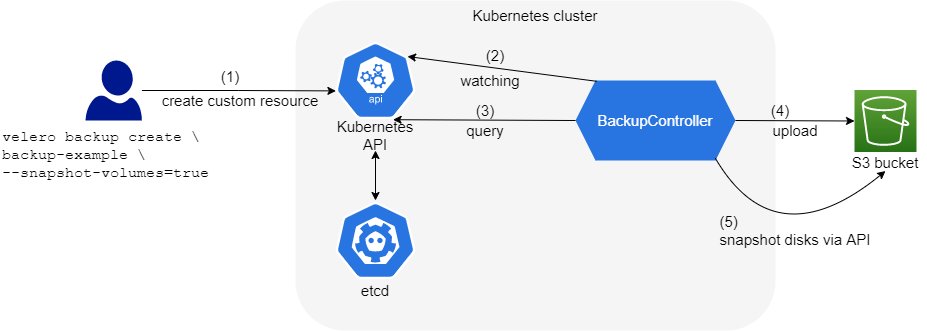

# 사용한 기술
  

### **[Terraform](https://www.terraform.io/)**  
AWS의 resource들을 편하고 일관성 있게 provisioning하기 위해 사용했다.

### **[Velero](https://velero.io/)**  
EKS 클러스터를 백업하기 위해 사용했다.  
etcdctl을 사용하지 않는 이유는 아래에 기술되어 있다.  
   

# Velero Vs. etcdctl
- Amazon EKS에서는 사용자가 etcd에 직접 접근할 수 없으므로 etcdctl은 사용하기가 어렵다.
- Kubernetes resource 뿐만 아니라 disk snapshot을 생성함으로써 PV 상태도 저장한다.
- etcdctl 자체 기능만으로는 scheduled back up이 불가능하다.
 

### 구성도

Terraform으로 EKS 클러스터, RDS, Bastion, S3 bucket 등을 provision하고 Velero가 EKS 클러스터를 S3 bucket으로 백업한다.
Velero에 관한 소개는 아래에 서술되어 있다.
 

# Velero
### **[Overview](https://velero.io/)** 
- Kubernetes cluster resource 및 persistent volume에 대한 백업 및 복구를 위한 도구
- Cloud 환경과 on-premise 환경 모두 사용할 수 있다.
- Cluster resource에 대한 migration이 가능하다.
- production cluster를 development cluster와 testing cluster로 복제할 수 있다.

다만 본 프로젝트에서는 사실상 첫 번째의 장점만을 차용하고 있다.

### **[How Velero backs up](https://velero.io/docs/v1.10/how-velero-works/#backup-workflow)**
#### 사용자가 `velero backup create test-backup`을 실행하면

1. Velero client는 `Backup` object를 생성하기 위해 Kubernetes API로 요청한다.  
2. `BackupController`는 Kubernetes API server를 감시(watch)하고 있다가 새로운 `Backup` object가 식별되면 검증(validation)을 수행한다.  
3. `BackupController`는 backup 과정을 시작한다. API server에 Kubernetes resource에 대한 요청을 보냄으로써 back up할 데이터를 수집한다.  
4. 수집한 데이터를 저장하기 위해 `BackupController`는 객체 저장 서비스(Ex: S3 bucket)로 요청한다.  

###### 참고
- 기본적으로 모든 PV; Persistent Volume의 disk snapshot을 생성한다.  
    disk snapshot을 생성하지 않으려면 `--snapshot-volume=false`를 지정한다.  
- `Backup`과 `BackupController`는 `velero install` 시 등록되는 CRD; Custom Resource Defined다.

### **[How Velero restores](https://velero.io/docs/v1.10/how-velero-works/#restore-workflow)**
#### 사용자가 `velero restore create`를 실행하면
1. Velero client는 `Restore` object를 생성하기 위해 Kubernetes API로 요청한다.
2. `RestoreController`는 `Restore` object를 식별하고 validation을 수행한다.
3. `RestoreController`는 object storage service로부터 백업 정보를 가져온다(fetch). 
4. 그리고 백업된 resource에 대한 전처리를 수행한다. 이는 새로운 클러스터에서도 백업된 리소스들이 정상적으로 동작하는 것을 보장하기 위해 거치는 과정이다.
5. `RestoreController`가 복원 과정을 시작한다. 복원 과정은 각 적절한(eligible) resource에 대해 한 번에 하나씩 이루어진다.

기본적으로 Velero는 **비파괴 복원 non-destructive restore**을 수행한다. 이는 target cluster에 존재하는 어떠한 데이터도 삭제하지 않음을 의미한다. 
즉 복원하려는 resource가 target cluster에 이미 존재한다면 그냥 skip한다.
skip하지 않고 바꾸려면 `--existing-resource-policy=update` 주면 된다. default는 `--existing-resource-policy=none`.
다만 backup resource와 target resource를 구분하는 방법은 직접적으로 서술되어 있지 않은 듯 하다.

###### 전처리
Velero는 각 resource에서 preferred version의 Kubernetes API server를 사용해 resource들을 backup한다. 그리고 복원할 때는 같은 버전의 Kubernetes API가 target cluster에 존재해야 복원이 성공적으로 이루어질 수 있다.

예를 들어 백업된 클러스터가 `things`라는 API group의 `gizmos`라는 resource를 갖고 있다고 하자. group/version은 `things/v1alpha1`, `things/v1beta1`, `things/v1`이며 서버의 preferred version은 `things/v1`이라 하자.  이 경우 모든 `gizmos`는 `things/v1`의 API endpoint로부터 백업된다.
이 때 `gizmos`가 복원되려면 target cluster는 반드시 `things/v1` API endpoint를 갖고 있어야 한다. 주의할 점은 `things/v1`이 target cluster의 preferrd version일 필요는 없다는 것. `things/v1` API endpoint가 그냥 존재하기만 하면 된다.

전처리는 백업된 API version을 사용해 복원할 resource가 target cluster에서 동작할 수 있는지 검증(verify)하는, 즉 백업된 API version의 endpoint가 target cluster에 존재하는지 확인하는 작업을 말한다.
