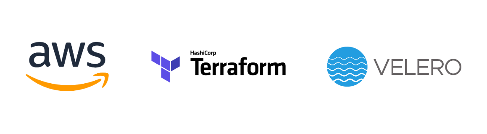
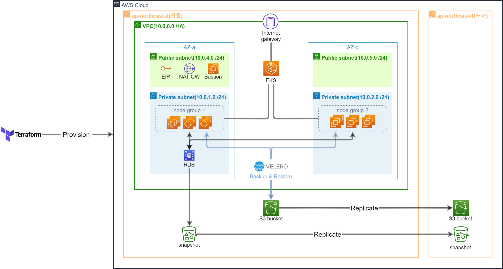

# 사용한 기술
  

### **[Terraform](https://www.terraform.io/)**  
AWS의 resource들을 편하고 일관성 있게 provisioning하기 위해 사용했다.

### **[Velero](https://velero.io/)**  
EKS 클러스터를 백업하기 위해 사용했다.  
etcdctl을 사용하지 않는 이유는 아래에 기술되어 있다.  
   

# Velero Vs. etcdctl
- Amazon EKS에서는 사용자가 etcd에 직접 접근할 수 없으므로 etcdctl은 사용하기가 어렵다.
- Kubernetes resource 뿐만 아니라 disk snapshot을 생성함으로써 PV 상태도 저장한다.
- etcdctl 자체 기능만으로는 scheduled back up이 불가능하다.
 

### 구성도

Terraform으로 EKS 클러스터, RDS, Bastion, S3 bucket 등을 provision하고 Velero가 EKS 클러스터를 S3 bucket으로 백업한다.
Velero에 관한 소개는 아래에 서술되어 있다.
 

# Velero
### **[Overview](https://velero.io/docs/v1.10/#overview)** 
- Kubernetes cluster resource 및 persistent volume에 대한 백업 및 복구를 위한 도구
- Cloud 환경과 on-premise 환경 모두 사용할 수 있다.
- Cluster resource에 대한 migration이 가능하다.
- production cluster를 development cluster와 testing cluster로 복제할 수 있다.

다만 본 프로젝트에서는 사실상 첫 번째의 장점만을 차용하고 있다.

Velero의 작동 원리 등은 [여기](https://velog.io/@kirisame/Velero%EB%A5%BC-%EC%82%AC%EC%9A%A9%ED%95%B4-Amazon-EKS-%ED%81%B4%EB%9F%AC%EC%8A%A4%ED%84%B0-%EB%B0%B1%EC%97%85%ED%95%98%EA%B8%B0)를 참고하기 바랍니다.
