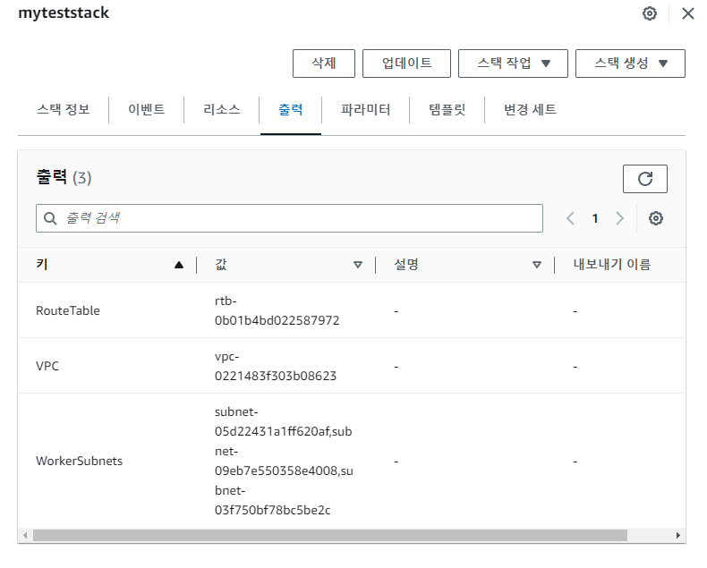
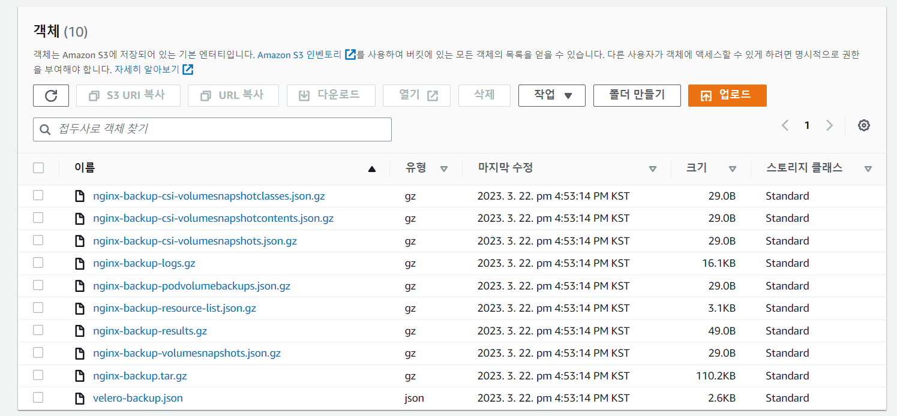
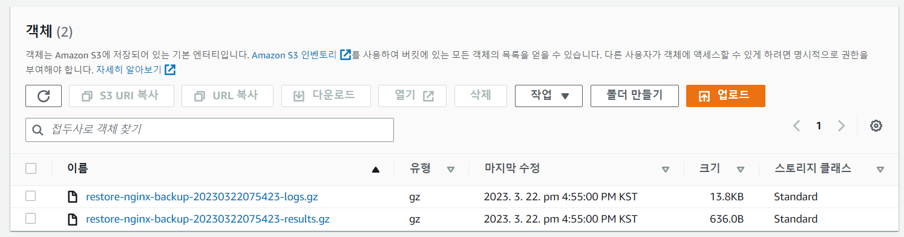
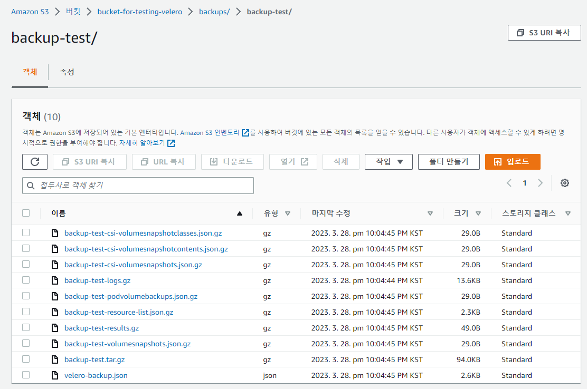
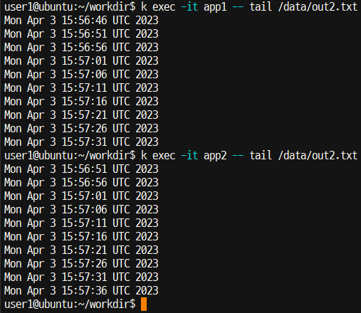
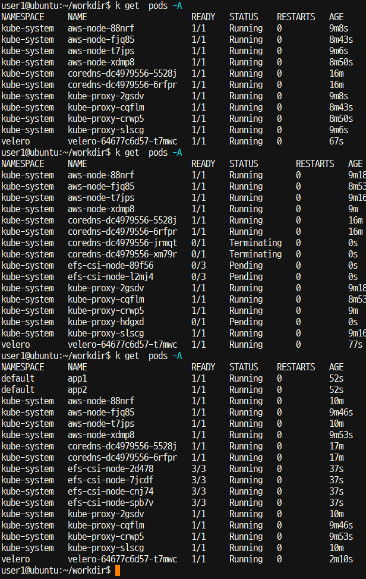

Linux(Ubuntu) 환경에서 user 권한으로 진행한다.

# 패키지 설치
### eksctl
```bash
curl --silent --location "https://github.com/weaveworks/eksctl/releases/latest/download/eksctl_$(uname -s)_amwd64.tar.gz" | tar xz -C /tmp
sudo mv /tmp/eksctl /usr/local/bin
```
eksctl을 받아온 후 명령어 디렉토리로 옮긴다.

```bash
eksctl version
```
설치를 확인한다.
<br>
### kubectl(1.24, amd64)
>https://docs.aws.amazon.com/ko_kr/eks/latest/userguide/install-kubectl.html
```bash
curl -O https://s3.us-west-2.amazonaws.com/amazon-eks/1.24.10/2023-01-30/bin/linux/amd64/kubectl
```
AWS의 S3에서 kubectl 바이너리를 다운로드한다.
```bash
chmod +x ./kubectl
```
다운로드한 바이너리에 실행 권한을 부여한다. 


1. Option 1
    ```bash
    mkdir -p $HOME/bin && cp ./kubectl $HOME/bin/kubectl && export PATH=$PATH:$HOME/bin
    ```
    바이너리를 복사한다.
2. Option 2
    ```
    sudo mv ./kubectl /usr/local/sbin
    ```
Option 1과 Option 2 중 하나를 선택한다.

```bash
kubectl version --short --client
```
설치를 확인한다.
<br>


### AWS CLI2
```bash
sudo apt -y install unzip
curl "https://awscli.amazonaws.com/awscli-exe-linux-x86_64.zip" -o "awscliv2.zip"
unzip awscliv2.zip
sudo ./aws/install
```
압축 해제를 위해 `unzip` 패키지를 설치하고 AWS CLI2의 압축 파일을 받아와 압축을 해제한다.
그리고 설치 파일을 실행한다(root 권한 필요).

```
rm -rf aws
rm -rf .aws
```

```bash
aws --version
```
설치를 확인한다.
<br>

# Velero
> https://github.com/vmware-tanzu/velero-plugin-for-aws

### Velero
- k8s 클러스터를 백업하는 도구
- EKS를 백업하려면 AWS를 위한 플러그인이 필요하다.
- EKS 백업은 크게 세 단계로 나뉜다.
    1. S3 bucket 생성
        백업 데이터는 여기에 저장된다.
    2. Velero를 위한 IAM 유저 및 권한 설정
        앞에서 본 권한은 여기서 생성한 후에 따로 추가한다.  
    3. Velero 설치 및 실행


### S3 bucket 생성
```bash
aws configure
AWS Access Key ID [None]: <ADMIN_ACCESS_KEY>
AWS Secret Access Key [None]: <ADMIN_SECRET_ACCESS_KEY>
Default region name [None]: ap-northeast-2
Default output format [None]:
```
aws configure로 먼저 자격 증명을 해야 한다.
편의상 admin(AdministratorAccess 권한이 있는 유저)으로 자격증명을 하는 게 좋다.


```bash
BUCKET=bucket-for-testing-velero
REGION=ap-northeast-2
aws s3api create-bucket \
    --bucket $BUCKET \
    --region $REGION \
    --create-bucket-configuration LocationConstraint=$REGION
```
S3 bucket 생성에 관한 IAM 정책이 필요하다(Ex: AmazonS3FullAccess).
리전은 _서울(ap-northeast-2)_이 아닌 _도쿄(ap-northeast-1)_로 했다.


### IAM 유저 생성
```bash
aws iam create-user --user-name <USER_TO_USE_VELERO>
```
`velero`라는 이름으로 생성했다.
이 IAM 유저는 Velero를 쓰기 위함이다. 클러스터 생성 등의 작업은 다 admin 권한으로 하는 것이 좋을 것이다.
아니면 자잘한 권한과 역할, action을 설정해야하 는데, 일일이 설정하는 것이 쉽지 않다.
<br>

### IAM 정책 생성 및 추가
```bash
cat > velero-policy.json <<EOF
{
    "Version": "2012-10-17",
    "Statement": [
        {
            "Effect": "Allow",
            "Action": [
                "ec2:DescribeVolumes",
                "ec2:DescribeSnapshots",
                "ec2:CreateTags",
                "ec2:CreateVolume",
                "ec2:CreateSnapshot",
                "ec2:DeleteSnapshot"
            ],
            "Resource": "*"
        },
        {
            "Effect": "Allow",
            "Action": [
                "s3:GetObject",
                "s3:DeleteObject",
                "s3:PutObject",
                "s3:AbortMultipartUpload",
                "s3:ListMultipartUploadParts"
            ],
            "Resource": [
                "arn:aws:s3:::${BUCKET}/*"
            ]
        },
        {
            "Effect": "Allow",
            "Action": [
                "s3:ListBucket"
            ],
            "Resource": [
                "arn:aws:s3:::${BUCKET}"
            ]
        }
    ]
}
EOF
```

```bash
aws iam put-user-policy \
  --user-name velero \
  --policy-name VeleroPolicy \
  --policy-document file://velero-policy.json
```
"야 정책"
"넣을게"

```bash
$ aws iam create-access-key --user-name velero

{
    "AccessKey": {
        "UserName": "velero",
        "AccessKeyId": "<VELERO_ACCESS_KEY_ID>",
        "Status": "Active",
        "SecretAccessKey": "<VELERO_SECRET_ACCESS_KEY>",
        "CreateDate": "2023-03-24T07:58:46+00:00"
    }
}

```
IAM 사용자 *velero*의 액세스 키를 생성한다(안 해도 됨).
썩 좋은 방법같지 않은 게, 콘솔에서는 .csv 파일로 저장할 수가 있는데 이거는 출력 한 번이 끝이다. secret key를 못 보고 터미널을 끄거나 하면 상당히 번거로워진다.
<br>

### Velero 설치
```bash
wget https://github.com/vmware-tanzu/velero/releases/download/v1.10.2/velero-v1.10.2-linux-amd64.tar.gz
tar -xvf velero-v1.10.2-linux-amd64.tar.gz
sudo mv velero-v1.10.2-linux-amd64/velero /usr/local/sbin
```
먼저 Velero를 설치한 후 velero 바이너리를 명령어 디렉토리로 옮긴다.
<br>

### Velero 실행하려면 클러스터가 있어야 한다.
```bash
# 이거 아직 못 함
velero install \
    --provider aws \
    --plugins velero/velero-plugin-for-aws:v1.6.0 \
    --bucket $BUCKET \
    --backup-location-config region=$REGION \
    --snapshot-location-config region=$REGION \
    --secret-file ./credentials-velero
```
을 하려면 k8s의 API server config, 그러니까 *~/.kube/config*와 같은 경로가 `--kubeconfig`로 주어져야 한다.
기본적으로 `$KUBECONFIG`라는 (환경?)변수를 참조하는데, 지금은 클러스터가 없으므로 우선 클러스터부터 만들어야 한다.
<br>

# EKS 클러스터 구성 
### 기본 리소스 구성
```bash
git clone https://github.com/dybooksIT/k8s-aws-book.git
```
<클라우드 네이티브를 위한 쿠버네티스 실전 프로젝트>\_아이자와 고지, 사토 가즈히코 저, 박상욱 옮김(동양북스) 참고했음
CloudFormation에서 사용할 manifest 파일의 경로는 다음과 같다.
```
k8s-aws-book/eks-env/01_base_resources_cfn.yaml
```
여기서 VPC, subnet 등 기본 리소스가 생성된다.
때문에 이에 관한 정책들도 필요하다.
다음과 같은 방법이 있다.
1. admin 계정으로 생성한다.
2. *AdministratorAccess* 정책을 추가해서 생성한 후 다시 삭제한다.
3. *CloudFormationFullAccess*과 다음 인라인 정책(ChatGPT피셜)을 추가한다.
    ```json
    {
      "Version": "2012-10-17",
      "Statement": [
        {
          "Effect": "Allow",
          "Action": [
              "ec2:CreateVpc",
              "ec2:CreateSubnet",
              "ec2:CreateInternetGateway",
              "ec2:AttachInternetGateway",
              "ec2:CreateRouteTable",
              "ec2:CreateRoute",
              "ec2:AssociateRouteTable",
              "ec2:ModifyVpcAttribute",
              "ec2:ModifySubnetAttribute",
              "ec2:DeleteVpc",
              "ec2:DeleteSubnet",
              "ec2:DeleteInternetGateway",
              "ec2:DetachInternetGateway",
              "ec2:DeleteRouteTable",
              "ec2:DeleteRoute",
              "ec2:DisassociateRouteTable"
          ],
          "Resource": "*"
        }
      ]
    }
    ```
현재는 어차피 admin으로 자격 증명이 되어 있으므로 리전만 변경한다.


```bash
aws cloudformation create-stack \
  --stack-name myteststack \
  --template-body file://<BASE_DIRECTORY>/k8s-aws-book/eks-env/01_base_resources_cfn.yaml
```
그냥 콘솔에서 *01_base_resources_cfn.yaml* 파일을 넣어서 만들어도 되고, 위와 같이 명령어를 쳐도 된다.
클러스터 생성 시에 서브넷 정보가 필요하므로 AWS 콘솔에서 이를 확인한다.


<br>

### 클러스터 구성
```bash
eksctl create cluster \
--vpc-public-subnets subnet-05d22431a1ff620af,subnet-09eb7e550358e4008,subnet-03f750bf78bc5be2c \
--name eks-work-cluster \
--region ap-northeast-2 \
--version 1.24 \
--nodegroup-name eks-work-nodegroup \
--node-type t2.small \
--nodes 2 \
--nodes-min 2 \
--nodes-max 5
```
이 명령어도 책에 나와 있는 건데, `--version 1.19`만 `--version 1.24`로 바꿨다.
`1.19`로 하면 더이상 지원되지 않으며, `1.22`~`1.25`만 지원한다고 메시지가 뜬다.
어차피 앞에서 `1.24`로 설치했으니까 `1.24`로 진행한다.


# Velero 실행

### k8s context부터 업데이트한다.
```bash
aws eks update-kubeconfig --region ap-northeast-2 --name eks-work-cluster
```
하면 주어진 클러스터에 대한 kubeconfig 파일이 *~/.kube/config*로 생성된다.
이 파일은 클러스터가 삭제돼도 남아있다(eksctl 명령어로 지워도 남아있음).

```bash
BUCKET=bucket-for-testing-velero
REGION=ap-northeast-2
velero install \
    --provider aws \
    --plugins velero/velero-plugin-for-aws:v1.6.0 \
    --bucket $BUCKET \
    --backup-location-config region=$REGION \
    --snapshot-location-config region=$REGION \
    --secret-file ./credentials-velero \
    --kubeconfig ~/.kube/config
```
`$BUCKET`과 `$REGION`에는 앞에서 만든 버킷의 정보가 들어간다.

```bash
kubectl logs deployment/velero -n velero
```
Velero가 잘 동작하는지 확인한다.

콘솔에서 확인해보면 S3에 아무 객체도 없다.
이건 아직 백업을 안 했기 때문이다. 백업은 따로 해줘야 한다.


### 제거
```bash
kubectl delete namespace/velero clusterrolebinding/velero
```
는 이렇게 하면 된다네요~
<br>

# Scheduled Backup
> Using Schedules and Read-Only Backup Storage Locations


##### 스케줄링 설정
```bash
velero schedule create <SCHEDULE NAME> --schedule "0 * * * *"
```
- `--schedule`에 주어진 시각에 자동으로 백업을 생성하도록 한다.
- `--schedule`에 주는 시각은 공백으로 구분하며 순서대로 분, 시, 일, 월, 요일을 의미한다.
- 분은 0\~59로, 시는 0\~23으로, 일은 1\~31로, 월은 1\~12로, 요일은 0\~6으로 정의한다.
- 요일의 0\~6은 각각 일, 월, 화, ..., 금, 토를 의미한다.
- 시스템에 따라 7도 일요일일 수 있다.
- 백업 객체의 이름은 `<SCHEDULE NAME>-<TIMESTAMP>`다.
- `<TIMESTAMP>`는 `YYYYMMddHHmmss` 형식이다.
- 백업 데이터의 기본 TTL은 720시간(30일)이다.
- TTL은 `--ttl 24h0m0s`과 같이 지정할 수 있다.
- `--schedule`에 주는 옵션은 다음과 같다.
    ```
     ┌───────────── minute (0 - 59)
     │ ┌───────────── hour (0 - 23)
     │ │ ┌───────────── day of the month (1 - 31)
     │ │ │ ┌───────────── month (1 - 12)
     │ │ │ │ ┌───────────── day of the week (0 - 6)
     │ │ │ │ │                                   
     │ │ │ │ │
     │ │ │ │ │
     * * * * *
    ```
    예를 들어 `"0 * * * *"`로 주면 매 정각에 백업이 발생한다.
    주의할 점은 표준시 기준이라는 것.
    한국은 GMT +9이므로 한국 시간의 9시간 전을 기준으로 생각하면 된다.


##### 재해가 발생하면
resource들을 재생성(복원)해야 한다.
복원하는 과정은 아래에 서술되어 있다.


###### 백업 데이터 저장소를 read-only 모드로 전환한다.
```bash
kubectl patch backupstoragelocation <STORAGE LOCATION NAME> \
    --namespace velero \
    --type merge \
    --patch '{"spec":{"accessMode":"ReadOnly"}}'
```
이는 복구 과정에서 백업 객체가 생성되거나 삭제되는 것을 막는다.


##### 복구
```bash
velero restore create --from-backup <SCHEDULE NAME>-<TIMESTAMP>
```
가장 최근의 백업 데이터로부터 복구한다.
또는 원하는 백업 데이터를 지정한다.


##### 백업 데이터 저장소를 read-write 모드로 되돌린다.
```bash
kubectl patch backupstoragelocation <STORAGE LOCATION NAME> \
   --namespace velero \
   --type merge \
   --patch '{"spec":{"accessMode":"ReadWrite"}}'
```
<br>


# 백업 및 복원 테스트

### pod 유지 테스트
```bash
user1@ubuntu:~$ kubectl run nginx --image=nginx
pod/nginx created
```
테스트를 위해 nginx 파드를 실행한다.

```bash
user1@ubuntu:~$ kubectl get pods -A
NAMESPACE       NAME                            READY   STATUS    RESTARTS   AGE
default         nginx                           1/1     Running   0          11s
kube-system     aws-node-knh6n                  1/1     Running   0          21m
kube-system     aws-node-r75z6                  1/1     Running   0          21m
kube-system     coredns-dc4979556-mqzcc         1/1     Running   0          30m
kube-system     coredns-dc4979556-z8zsw         1/1     Running   0          30m
kube-system     kube-proxy-7mfjh                1/1     Running   0          21m
kube-system     kube-proxy-d58xr                1/1     Running   0          21m
nginx-example   nginx-deploy-777fbd6cdf-twmwp   0/1     Pending   0          3m2                                                                                       0s
velero          velero-64677c6d57-l7h6x         1/1     Running   0          15m
```
nginx 파드 실행 상태를 확인한다.

```bash
user1@ubuntu:~$ velero backup create nginx-backup
Backup request "nginx-backup" submitted successfully.
Run `velero backup describe nginx-backup` or `velero backup logs nginx-backup` for more details.
```
백업 파일을 생성한다.
S3의 *<MY\_BUCKET>/backups/<BACKUP\_NAME>/* 에 저장된다.


```bash
user1@ubuntu:~$ kubectl delete pod nginx
pod "nginx" deleted

user1@ubuntu:~$ kubectl get pod -A
NAMESPACE       NAME                            READY   STATUS    RESTARTS   AGE
kube-system     aws-node-knh6n                  1/1     Running   0          23m
kube-system     aws-node-r75z6                  1/1     Running   0          23m
kube-system     coredns-dc4979556-mqzcc         1/1     Running   0          32m
kube-system     coredns-dc4979556-z8zsw         1/1     Running   0          32m
kube-system     kube-proxy-7mfjh                1/1     Running   0          23m
kube-system     kube-proxy-d58xr                1/1     Running   0          23m
nginx-example   nginx-deploy-777fbd6cdf-twmwp   0/1     Pending   0          5m3                                                                                       3s
velero          velero-64677c6d57-l7h6x         1/1     Running   0          17m
```
방금 띄운 nginx 파드를 삭제한 후 삭제 여부를 확인한다.

```bash
user1@ubuntu:~$ velero restore create --from-backup nginx-backup
Restore request "nginx-backup-20230322075423" submitted successfully.
Run `velero restore describe nginx-backup-20230322075423` or `velero restore log                                                                                       s nginx-backup-20230322075423` for more details.
```
복원한다.
복원 결과와 로그는 *<MY_BUCKET>/restores/nginx-backup-yyyyMMddHHmmss*/에 저장된다.


```bash
user1@ubuntu:~$ kubectl get pod -A
NAMESPACE       NAME                            READY   STATUS    RESTARTS   AGE
default         nginx                           1/1     Running   0          27s
kube-system     aws-node-knh6n                  1/1     Running   0          24m
kube-system     aws-node-r75z6                  1/1     Running   0          24m
kube-system     coredns-dc4979556-mqzcc         1/1     Running   0          34m
kube-system     coredns-dc4979556-z8zsw         1/1     Running   0          34m
kube-system     kube-proxy-7mfjh                1/1     Running   0          24m
kube-system     kube-proxy-d58xr                1/1     Running   0          24m
velero          velero-64677c6d57-l7h6x         1/1     Running   0          18m
```
클러스터가 복구됐음(nginx 파드가 다시 생성됐음)을 확인한다.

<br>

# 테스트

### 클러스터 삭제 후에도 복구되는가?
현재 백업이 저장되는 리전(버킷의 리전)은 *(도쿄 ap-northeast-1)*, 클러스터가 위치한 리전은 <i>서울(ap-northeast-2)</i>이다. 따라서 테스트는 다음과 같이 진행한다.

1. 백업 파일을 생성한다.
2. eksctl 명령어로 삭제한 후 복구한다.
    - CloudFormation 스택이 없는 상태에서도 복구가 가능한가?
    - 리전도 원래대로(서울로) 복구되는가?
    - 파드에 할당된 IP 주소도 그대로 복구되는가?

```bash
user1@ubuntu:~/workdir$ k get pod -A
NAMESPACE     NAME                      READY   STATUS    RESTARTS   AGE
default       multiple-containers       2/2     Running   0          7m1s
kube-system   aws-node-hv5s9            1/1     Running   0          3h26m
kube-system   aws-node-x22sp            1/1     Running   0          3h26m
kube-system   coredns-dc4979556-6zj76   1/1     Running   0          3h35m
kube-system   coredns-dc4979556-c6zsq   1/1     Running   0          3h35m
kube-system   kube-proxy-8rlkv          1/1     Running   0          3h26m
kube-system   kube-proxy-f8lzx          1/1     Running   0          3h26m
velero        velero-64677c6d57-zvfrj   1/1     Running   0          3h9m
```
현재 실행 중인 파드를 확인한다.

```bash
user1@ubuntu:~/workdir$ k get pods -o wide
NAME                  READY   STATUS    RESTARTS   AGE    IP              NODE                                               NOMINATED NODE   READINESS GATES
multiple-containers   2/2     Running   0          2m6s   192.168.0.150   ip-192-168-0-178.ap-northeast-2.compute.internal   <none>           <none>
```
파드의 IP 주소 `192.168.0.150`을 확인해야 한다.

```
velero backup create backup-test
```
백업을 생성한다.



백업 생성을 확인한다.

```bash
eksctl delete cluster --region=ap-northeast-2 --name=eks-work-cluster
```
클러스터를 삭제한다.

```bash
user1@ubuntu:~/workdir$ velero restore create --from-backup backup-test
An error occurred: Get "https://8CFCF6C6E4838202A83DC4FDD3981984.gr7.ap-northeast-2.eks.amazonaws.com/apis/velero.io/v1/namespaces/velero/backups/backup-test": dial tcp: lookup 8CFCF6C6E4838202A83DC4FDD3981984.gr7.ap-northeast-2.eks.amazonaws.com on 127.0.0.53:53: no such host
```
복원은 EKS 클러스터 위에 띄워져 있는 velero resource의해 수행되는 것이기 때문에 클러스터 없이는 복원이 안 되는 듯하다.


```bash
eksctl create cluster \
--vpc-public-subnets subnet-05d22431a1ff620af,subnet-09eb7e550358e4008,subnet-03f750bf78bc5be2c \
--name eks-work-cluster \
--region ap-northeast-2 \
--version 1.24 \
--nodegroup-name eks-work-nodegroup \
--node-type t2.small \
--nodes 2 \
--nodes-min 2 \
--nodes-max 5
```
클러스터를 생성한다.

```bash
user1@ubuntu:~/workdir$ velero restore create --from-backup backup-test
An error occurred: the server could not find the requested resource (get backups.velero.io backup-test)
```
이 경우에도 현재 갖고 있는 kubernetes context에 대응되는 클러스터가 존재하지 않으므로 안 된다.


```bash
aws eks update-kubeconfig --region ap-northeast-2 --name eks-work-cluster
```
현재 만든 클러스터의 정보로 kubernetes context를 업데이트 한다.


```bash
BUCKET=bucket-for-testing-velero
REGION=ap-northeast-2
velero install \
    --provider aws \
    --plugins velero/velero-plugin-for-aws:v1.6.0 \
    --bucket $BUCKET \
    --backup-location-config region=$REGION \
    --snapshot-location-config region=$REGION \
    --secret-file ./credentials-velero \
    --kubeconfig ~/.kube/config
```
velero 파드를 설치한다.

```bash
user1@ubuntu:~/workdir$ velero restore create --from-backup backup-test
Restore request "backup-test-20230328134505" submitted successfully.
Run `velero restore describe backup-test-20230328134505` or `velero restore logs backup-test-20230328134505` for more details.
```

<br>

```bash
user1@ubuntu:~/workdir$ k get pods -A
NAMESPACE     NAME                      READY   STATUS    RESTARTS   AGE
default       multiple-containers       2/2     Running   0          21s
kube-system   aws-node-f5rp5            1/1     Running   0          7m29s
kube-system   aws-node-fz54k            1/1     Running   0          7m28s
kube-system   coredns-dc4979556-7mhqk   1/1     Running   0          17m
kube-system   coredns-dc4979556-8p2xd   1/1     Running   0          17m
kube-system   kube-proxy-2w94d          1/1     Running   0          7m28s
kube-system   kube-proxy-r45sc          1/1     Running   0          7m29s
velero        velero-64677c6d57-gzsm8   1/1     Running   0          118s
```
resource는 정상적으로 동작된다.

```bash
user1@ubuntu:~/workdir$ k get pod multiple-containers -o wide
NAME                  READY   STATUS    RESTARTS   AGE     IP              NODE                                               NOMINATED NODE   READINESS GATES
multiple-containers   2/2     Running   0          2m15s   192.168.0.102   ip-192-168-0-193.ap-northeast-2.compute.internal   <none>           <none>

```
다만 pod가 할당받은 IP 주소까지 복구되지는 않는다. 
<br>

### 볼륨은 유지되는가?
우선 EKS에서 Amazon EFS를 사용하기 위한 설정을 마친다. 이에 관한 내용은 [여기](https://velog.io/@squarebird/AWS-EKS%EC%97%90%EC%84%9C-EFS-%EC%82%AC%EC%9A%A9%ED%95%98%EA%B8%B0)를 참조하기 바란다.
즉 pod1과 pod2가 `/data`에 persistent volume을 mount한 상태다.
이 상태에서 백업을 진행한다.
```bash
velero backup create backup-test
```
`backup-test`라는 이름으로 백업을 생성한다.
S3에 백업이 저장됐는지 확인한 후 다음 작업을 진행한다.

```bash
eksctl delete cluster --region=ap-northeast-2 --name=eks-work-cluster
```
클러스터를 삭제한다.

```bash
eksctl create cluster \
--vpc-public-subnets subnet-05d22431a1ff620af,subnet-09eb7e550358e4008,subnet-03f750bf78bc5be2c \
--name eks-test-cluster \
--region ap-northeast-2 \
--version 1.24 \
--nodegroup-name eks-work-nodegroup \
--node-type t2.small \
--nodes 4 \
--nodes-min 3 \
--nodes-max 5
```
테스트를 위해 이전 클러스터와 다른 구성과 이름으로 생성한다.
원래는 노드의 최소 갯수를 2로 하고 2개만 생성했다.

```bash
aws eks update-kubeconfig --region ap-northeast-2 --name eks-test-cluster
```
kubeconfig 파일을 업데이트한다.


```bash
BUCKET=bucket-for-testing-velero
REGION=ap-northeast-2
velero install \
    --provider aws \
    --plugins velero/velero-plugin-for-aws:v1.6.0 \
    --bucket $BUCKET \
    --backup-location-config region=$REGION \
    --snapshot-location-config region=$REGION \
    --secret-file ./credentials-velero \
    --kubeconfig ~/.kube/config
```
Velero를 배포한다.

```bash
velero restore create --from-backup backup-test
```
아까 백업한 파일로부터 복구한다.


coredns 파드가 종료되고 다시 생성된다.
결과적으로 복구는 되고, 이제 확인할 것은 볼륨이다.

```bash
k exec -it app1 -- tail /data/out2.txt
k exec -it app2 -- tail /data/out2.txt
```
파일 내용을 확인한다.



<br>

### 세 줄 요약
1. 클러스터 삭제하고 바로 복구는 안 됨.
2. 클러스터 새로 생성하고 kubeconfig 파일 업데이트하고 복구하면 그대로 복구됨
    대신 파드 IP주소까지 복구되지는 않음.
3. 따라서 클러스터의 리전까지도 복구된다는 말 자체가 어폐가 있는 것 같고, 새로 만드는 클러스터를 다른 리전으로 하면 그냥 그거 따라가는 듯 하다.

이 결과에 따르면 Velero는 백업 시점에 만들어진 object들의 manifest를 다시 실행하는 것처럼 복구한다고 볼 수 있다.
스냅샷에 가까운 형태.

<br>

# 주의할 점

### 백업 데이터를 저장할 버킷은 비워져 있어야 한다.
정확히는 최상위 경로에 디렉토리가 있으면 에러가 발생한다.
파일은 있어도 된다.
